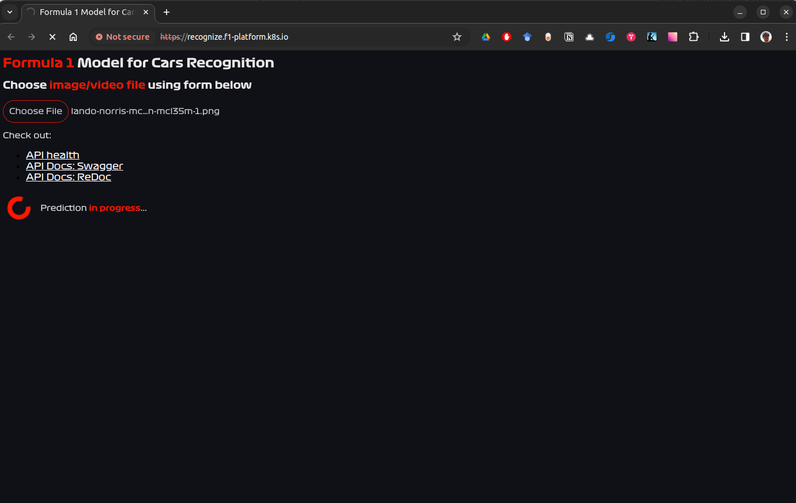
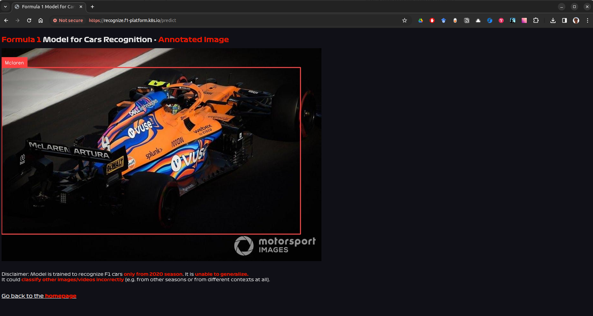
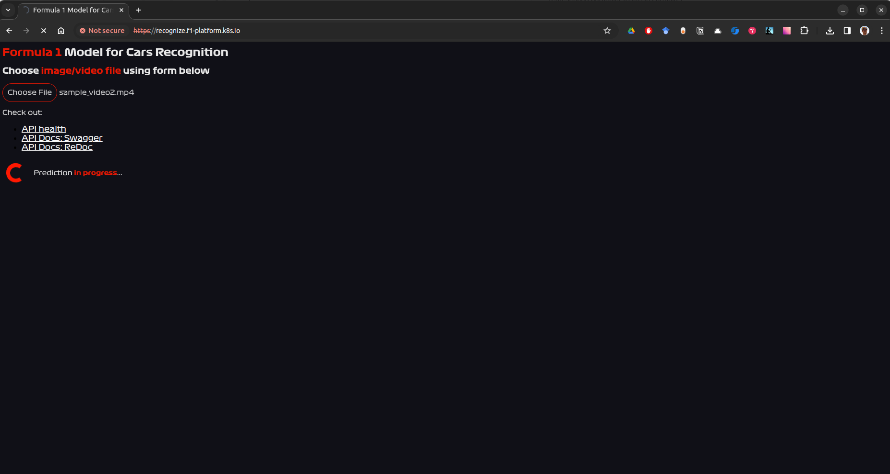
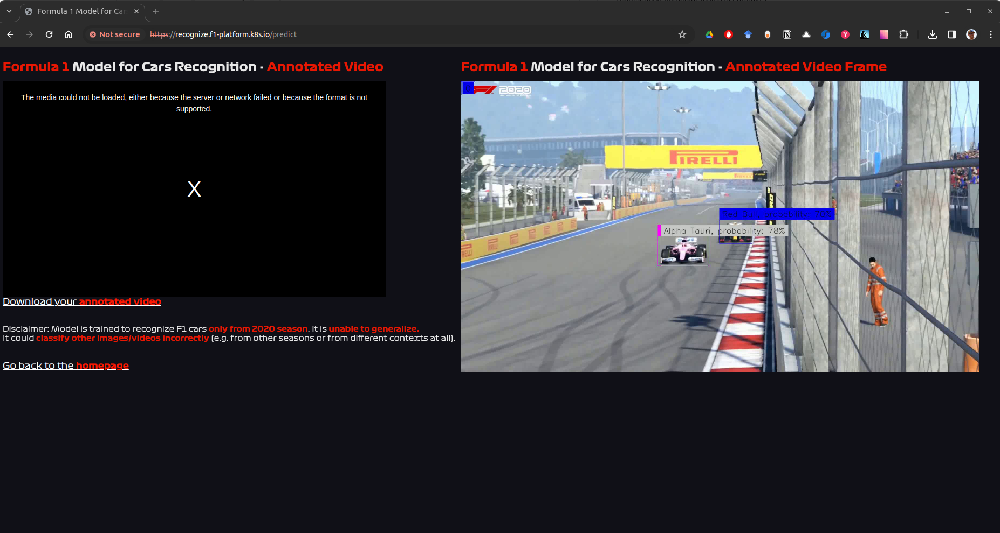

# formula-one-recognition-model
Repository holds code and data for video classification model - of cars representing particular teams in Formula 1.

# Repository structure
- `/images/`: exemplary screenshots of the solution are stored here - to ilustrate how it looks and works,
- `/input/`: data for checking model accuracy is stored here,
- `/models/`: binary files with trained ML models used across the solution,
- `/requirements/`: folder with apt/python/binary package requirements necessary for API to work properly,
- `/static/`: folder for serving model-annotated files. Cleaned-up after sending any request to `/predict` API endpoint,
- `/templates/`: HTML templates to render with `Jinja` Python templating framework,
- `/vision/`: folder with Pytorch-related functions,
- `.dockerignore`: file with objects to be ignored by Docker during build,
- `.gitignore`: file with objects to be ignored by Git,
- `constants.py` and `functions.py`: Python modules for separating code from `main.py` API file,
- `main.py`: Python file with API implementation and endpoints created with `FastAPI` framework,
- `formula-one-video-classification.ipynb`: improved / fixed jupyter notebook explaining model usage process (by [tarik-yilmaz-kanzileri on Roboflow](https://universe.roboflow.com/tarik-yilmaz-kanzileri/detection-f1-cars)),

- `README.md`: `Markdown`-based file you are currently reading,

- `environment.yaml`: file with full package requirements, necessary for above-mentioned `jupyter notebook` to work without errors.

# Docker image
## Building
```
docker build --no-cache \
--build-arg MINIO_URL="<change_me>" \
--build-arg MINIO_ACCESS_KEY="<change_me>" \
--build-arg MINIO_SECRET_KEY="<change_me>" \
-t f1-recognition-model:v0.7 -f Dockerfile .
```
## Running
```
docker run -it \
-e MINIO_URL="<change_me>" \
-e MINIO_ACCESS_KEY="<change_me>" \
-e MINIO_SECRET_KEY="<change_me>" \
f1-recognition-model:v0.7
```

# Adding image to use in minikube
`minikube image load f1-recognition-model:v0.7`

# Example
## Image
### Base

### Homepage

### Predict 

### Annotated

## Video
### Base

### Homepage

## Predict

### Annotated


# Model 
## Statistics
- Version: `11`,
- Classes:
  - confirmed:
    - `Ferrari`,
    - `Mclaren`,
    - `Mercedes`,
    - `Redbull`.
  - not confimed:
    - `Williams`,
    - `Alpine`,
    - `Haas`,
    - `Alpha_Tauri`,
    - `BWT`.
  - missing:
    - `Sauber`.
- mAP: `95.5%`,
- Precision: `92.0%`,
- Recall: `93.9%`.

## Output
bounding box with Team name and probability

## Training Graphs


# Sources / Acknowledgements
## F1 Cars Video
### classification model: [by Tarik Yilmaz Kanzileri, available here](https://universe.roboflow.com/tarik-yilmaz-kanzileri),
### containerization and API creation: [by Aleksander Zawalich, available here](https://github.com/azawalich).